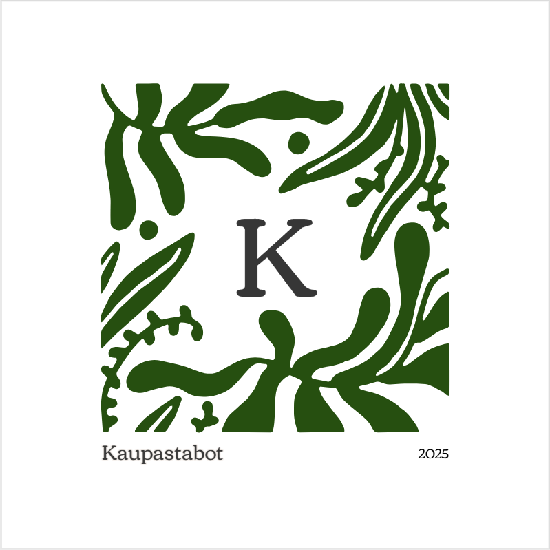

# Kaupastabot

A self-hosted Telegram bot born partly from frustration (there was no cheese left in the fridge!). With the bot, users can add items to the shared shopping list and gain points if the items they added get bought. Perfect (well, not perfect, but it sounds good marketing wise) for families that do not want to use Google Keep or similar services.

## Features

- Add items to a self-hosted, shared shopping list
- Get points if the item you added gets marked bought

## Commands

|Command|Description|
|-----|-----|
|/add|Enters the add mode, allowing users to add stuff to the list
|/done|Leaves the add mode|
|/list|Displays the current shopping list as a text-based list|
|/shop|Displays the current shopping list as an interactive list|
|/clear|Clears the current shopping list|
|/scoreboard|Displays the current scoreboard|

Additional commands, that are not visible on the menu:
|Command|Description|
|-----|-----|
|/id|Fetches the user's Telegram user ID so they can be added to the allowed users list|
|/emptyscoreboard|Resets the scoreboard|
|/start|Starts the bot and provides short instructions|

## How to use it

1) Download the code from this GitHub repository
2) Create yourself a Telegram bot using the BotFather and get your API key from there
3) Get your Telegram user ID (from @userinfobot for example)
4) Run setup.py and enter your API key and user ID when prompted
    - The setup creates a folder called "auth", which contains:
        - kaupastabot_api.txt - the API key you entered
        - allowedUsers.txt - a list of Telegram user IDs allowed to access your bot
5) Run main.py and start a chat with your bot in Telegram

## To do

- Language selection
- Database backup system